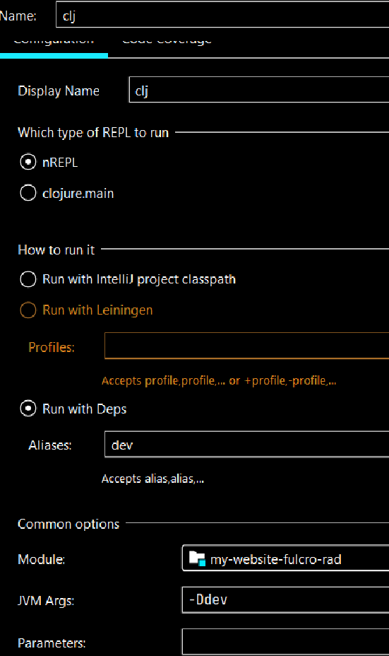
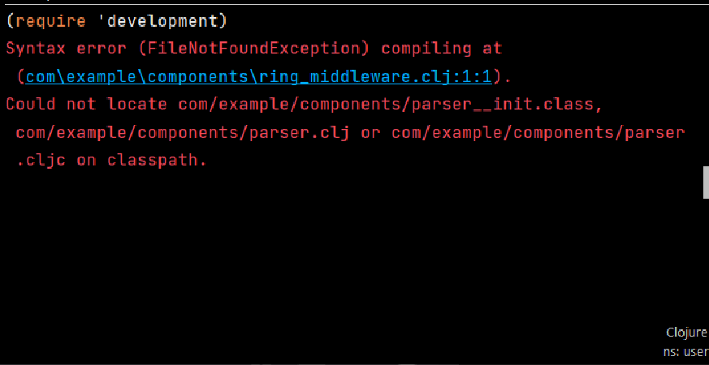
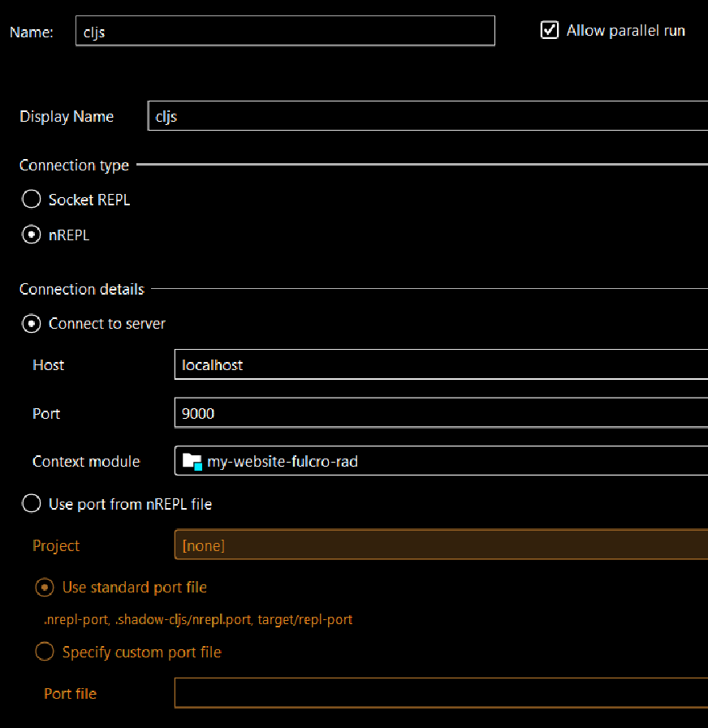
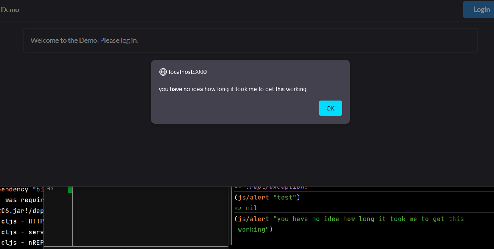

# What's this?
This is how I get a fulcro setup running after cloning from the repo.

# Useful info

`yarn` to install

`yarn shadow-cljs server` to start server

go to 9630 on the localhost and watch main

set up repl config

e.g.

(-Ddev is just for intellij according to Tony in a vid on his YT channel)

run the repl

fix repl complaints when you try to switch to development file (I removed them, but if you plan on using the relevant namespaces you should actually figure out why they're not being identified)

e.g.

import the namespace => `(require 'development)`

hop into that namespace => `(in-ns 'development)`

start calls mount, look in the development file for more info => `(start)`

nav to 3000 localhost, your stuff should be there

make remote nrepl in run config

run it to gain access to cljs files and the localhost stuff

config:

repl command:

you can run things in the browser, so that's pretty cool I guess

image::docs/alert-in-browser.png[]

have fun!
